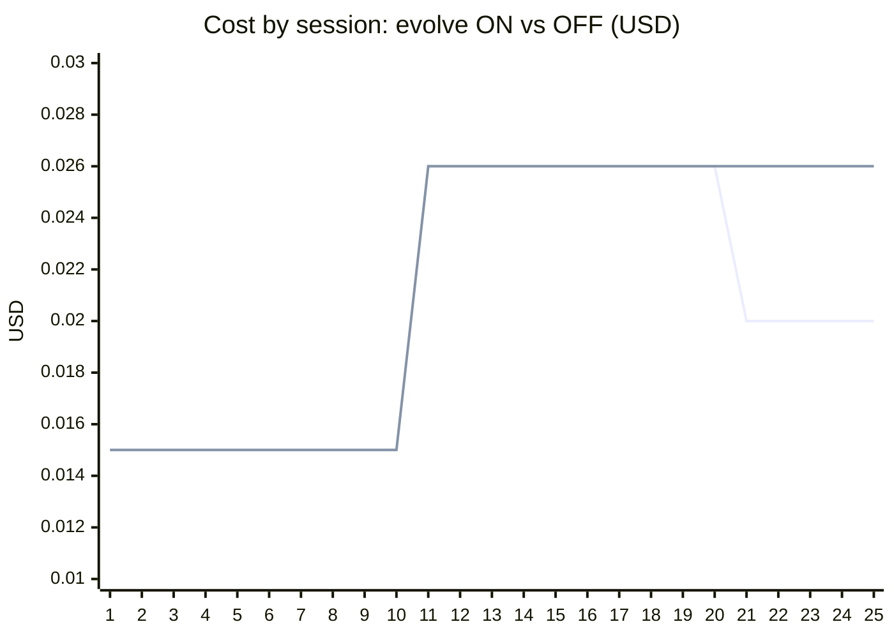
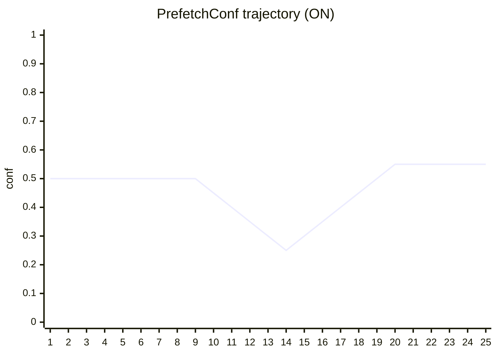

# Agile 2 自进化曲线（U43）

> 采数类型：固定种子、固定任务族的受控 harness 会话；使用生产 `MatrixPrefetcher`、`evolve.Engine`、`EvolutionLoop` 与 event wire。可重复 DoD 证据（`go run ./scripts/evolution-curve` 逐位复现），不代表外部模型基准。

## 实验 1：闭环接线验证（稳定任务族，20 会话）

- 任务族：每会话成功执行 `grep → read_file`；冷启动噪声先验 `grep→glob` 6 次、`grep→read_file` 4 次
- evolve：`MinSamples=20, FreezeEpochs=1`（采数配置）
- 成本模型：`0.020 − hit×0.005 + waste×0.002 USD`

**定性（评审修订）**：本实验证明闭环**接线生效**——三事件正常发射入 JSONL、`EvolutionTick` 在参数变化时出现、`prefetch_conf` 于第 19-20 会话按正确方向下调（持续命中 → 放宽预取门槛）。**命中率 0.5→1.0 的提升发生在第 2 会话，来自转移矩阵热身，与参数进化无因果**（tau 全程未动，conf 首次变化晚于提升 17 个会话）。自进化的收益证明见实验 2。

| 指标 | 首 5 | 末 5 | 门槛 | 结果 |
|---|---:|---:|---|---|
| 命中率 | 0.900 | 1.000 | 末 5 ≥ 首 5 | PASS |
| 成本 USD | 0.015 | 0.015 | 末 5 ≤ 首 5 | PASS |
| EvolutionTick | — | conf 0.50→0.40 | 至少一次参数变化被发射 | PASS |

## 实验 2：evolve 因果对照（制度性变更 churn，25 会话 × on/off）

- 阶段 A（1-10）：稳定族 `grep → read_file`；阶段 B（11-25）：**制度性变更**——每会话出现全新后继工具，既学候选全部过期
- 两组共享：相同先验、相同负载、相同矩阵级 hit/waste 反馈（对照组手动喂入）——**唯一差异 = EvolutionLoop 是否在线调 `PrefetchConf`**
- 采数配置：`TopK=1, MinConf=0.30`；ON 组 `MinSamples=10, FreezeEpochs=1`
- 成本模型：`0.020 − hit×0.005 + waste×0.006 USD`——waste 高于 hit 节省，反映「预取错误执行了真实只读工具且产物被丢弃」（盈亏平衡精度 ≈ 54.5%）

| 指标 | evolve ON | evolve OFF | 门槛 | 结果 |
|---|---:|---:|---|---|
| churn 期浪费预取（次） | 10 | 15 | ON < OFF | PASS |
| 25 会话总成本 USD | 0.510 | 0.540 | ON < OFF | PASS |
| 阶段 A 两组一致性 | 0.150 | 0.150 | 完全一致（对照有效） | PASS |

（上线 = ON，下线 = OFF；churn 开始于第 11 会话）

### 机制分解（三层防线的各自贡献）

churn 下止损有三条独立机制，实验数据可分离：① **evolve 全局门控**（仅 ON）：纯 waste 流抬升 `PrefetchConf` 越过过期候选的转移概率，一次性关停（第 21 会话生效；EWMA 惯性带来 ~4 会话调整滞后，conf 先随阶段 A 余温降至 0.25 再爬升）；② **计数漂移**（两组皆有，**本窗口内失效**）：阶段 A 把 `grep→read_file` 概率推至 0.80，churn 稀释 15 会话后仍为 0.46 > MinConf 0.30——OFF 组浪费在窗口内没有自然上界；③ **单目标降级 `demoted()`**（两组皆有，本场景失效）：曾有命中历史的候选 hit EWMA 冻结高位，waste/hit 比值数学上限 1/hitEWMA < 3.0 门槛，**永不触发**（见「发现」）。

### 实验暴露的两个产品级发现（随本 PR 立 issue 跟进）

1. **闭环吸收态**：conf 抬升把预取全部关停后，hit/waste 事件流随之消失，引擎再无信号、参数永久冻结——churn 结束后 ON 组无法自动恢复预取（本实验 conf 轨迹尾段平直即为证据）。需要 ε-探索或 conf 时间衰减作为逃逸机制。
2. **`demoted()` 免疫缺陷**：hit EWMA 只在命中时更新，纯 waste 流下冻结不衰减；`WasteHitLimit=3.0` 时任何 hit EWMA > 1/3 的历史优等生永不降级。单目标防线对「曾经好用、现已过期」的候选失效。

## 数据表（实验 2，ON 组）

| # | session | hit | waste | cost | conf |
|---:|---|---:|---:|---:|---:|
| 1 | u43-causal-on-01 | 1 | 0 | 0.015 | 0.500 |
| 2 | u43-causal-on-02 | 1 | 0 | 0.015 | 0.500 |
| 3 | u43-causal-on-03 | 1 | 0 | 0.015 | 0.500 |
| 4 | u43-causal-on-04 | 1 | 0 | 0.015 | 0.500 |
| 5 | u43-causal-on-05 | 1 | 0 | 0.015 | 0.500 |
| 6 | u43-causal-on-06 | 1 | 0 | 0.015 | 0.500 |
| 7 | u43-causal-on-07 | 1 | 0 | 0.015 | 0.500 |
| 8 | u43-causal-on-08 | 1 | 0 | 0.015 | 0.500 |
| 9 | u43-causal-on-09 | 1 | 0 | 0.015 | 0.500 |
| 10 | u43-causal-on-10 | 1 | 0 | 0.015 | 0.450 |
| 11 | u43-causal-on-11 | 0 | 1 | 0.026 | 0.400 |
| 12 | u43-causal-on-12 | 0 | 1 | 0.026 | 0.350 |
| 13 | u43-causal-on-13 | 0 | 1 | 0.026 | 0.300 |
| 14 | u43-causal-on-14 | 0 | 1 | 0.026 | 0.250 |
| 15 | u43-causal-on-15 | 0 | 1 | 0.026 | 0.300 |
| 16 | u43-causal-on-16 | 0 | 1 | 0.026 | 0.350 |
| 17 | u43-causal-on-17 | 0 | 1 | 0.026 | 0.400 |
| 18 | u43-causal-on-18 | 0 | 1 | 0.026 | 0.450 |
| 19 | u43-causal-on-19 | 0 | 1 | 0.026 | 0.500 |
| 20 | u43-causal-on-20 | 0 | 1 | 0.026 | 0.550 |
| 21 | u43-causal-on-21 | 0 | 0 | 0.020 | 0.550 |
| 22 | u43-causal-on-22 | 0 | 0 | 0.020 | 0.550 |
| 23 | u43-causal-on-23 | 0 | 0 | 0.020 | 0.550 |
| 24 | u43-causal-on-24 | 0 | 0 | 0.020 | 0.550 |
| 25 | u43-causal-on-25 | 0 | 0 | 0.020 | 0.550 |

## 原始证据

- `docs/reports/data/agile2-evolution-curve/summary.csv`（实验 1）
- `docs/reports/data/agile2-evolution-curve/causal-on.csv` / `causal-off.csv`（实验 2）
- `docs/reports/data/agile2-evolution-curve/sessions.jsonl` / `causal-sessions-on.jsonl`（三事件 wire 流）
- 重跑：`go run ./scripts/evolution-curve`（确定性，逐位一致）

## 边界声明

受控实验隔离的是调度/预取/进化机制本身，不含 LLM 质量维度；「真实会话 JSONL + `semantix search` 可检索」的验收项按 #194 顺序在合入后以真实采数补第二版（依赖 #234 的 usage 重放与 #239 的固定环境）。
