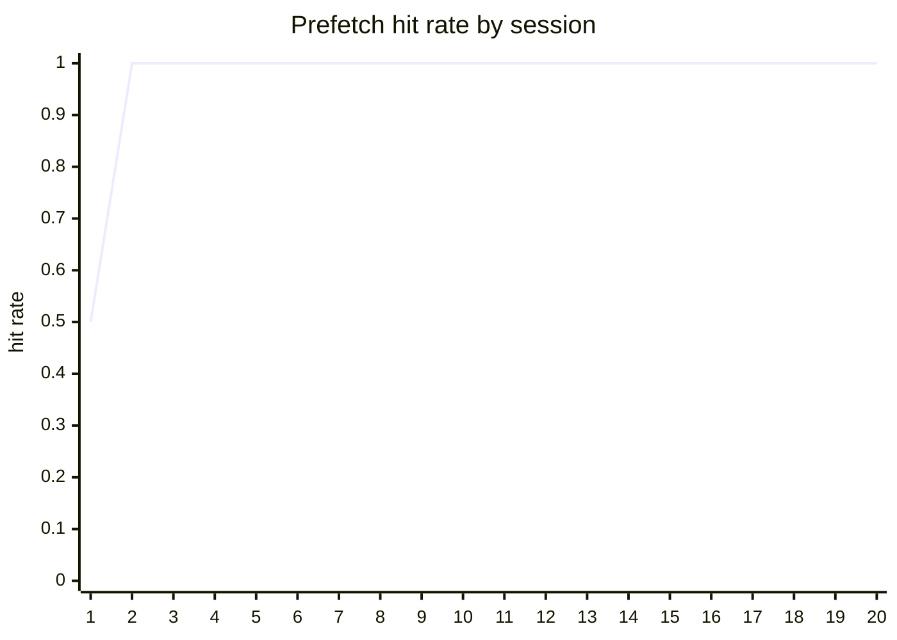
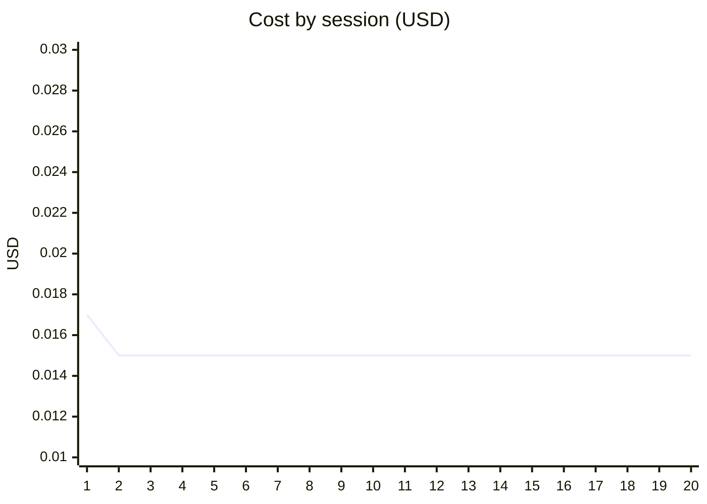

# Agile 2 自进化曲线（U43）

> 采数类型：固定种子、固定任务族的受控 harness 会话；使用生产 `MatrixPrefetcher`、`evolve.Engine`、`EvolutionLoop` 与 event wire。它是可重复 DoD 证据，不代表外部模型基准。

## 环境与协议

- 日期：2026-08-18
- 会话数：20（独立 session_id）
- 任务族：每次成功执行 `grep → read_file`
- 冷启动噪声先验：`grep→glob` 6 次、`grep→read_file` 4 次
- evolve：`MinSamples=20`, `FreezeEpochs=1`（采数配置；生产默认未改）
- 成本模型：`0.020 - hit×0.005 + waste×0.002 USD`，固定 oracle 全部成功

## 汇总

| 指标 | 首 5 | 末 5 | 门槛 | 结果 |
|---|---:|---:|---|---|
| 命中率 | 0.900 | 1.000 | 末 5 ≥ 首 5 | PASS |
| 成本 USD | 0.015 | 0.015 | 末 5 ≤ 首 5 | PASS |
| 任务成功率 | 1.000 | 1.000 | 不下降 | PASS |

## 趋势图

## 数据表

| # | session | hit | waste | hit rate | cost | tau_l2 | prefetch_conf | success |
|---:|---|---:|---:|---:|---:|---:|---:|---|
| 1 | u43-task-family-01 | 1 | 1 | 0.500 | 0.017 | 0.550 | 0.500 | true |
| 2 | u43-task-family-02 | 1 | 0 | 1.000 | 0.015 | 0.550 | 0.500 | true |
| 3 | u43-task-family-03 | 1 | 0 | 1.000 | 0.015 | 0.550 | 0.500 | true |
| 4 | u43-task-family-04 | 1 | 0 | 1.000 | 0.015 | 0.550 | 0.500 | true |
| 5 | u43-task-family-05 | 1 | 0 | 1.000 | 0.015 | 0.550 | 0.500 | true |
| 6 | u43-task-family-06 | 1 | 0 | 1.000 | 0.015 | 0.550 | 0.500 | true |
| 7 | u43-task-family-07 | 1 | 0 | 1.000 | 0.015 | 0.550 | 0.500 | true |
| 8 | u43-task-family-08 | 1 | 0 | 1.000 | 0.015 | 0.550 | 0.500 | true |
| 9 | u43-task-family-09 | 1 | 0 | 1.000 | 0.015 | 0.550 | 0.500 | true |
| 10 | u43-task-family-10 | 1 | 0 | 1.000 | 0.015 | 0.550 | 0.500 | true |
| 11 | u43-task-family-11 | 1 | 0 | 1.000 | 0.015 | 0.550 | 0.500 | true |
| 12 | u43-task-family-12 | 1 | 0 | 1.000 | 0.015 | 0.550 | 0.500 | true |
| 13 | u43-task-family-13 | 1 | 0 | 1.000 | 0.015 | 0.550 | 0.500 | true |
| 14 | u43-task-family-14 | 1 | 0 | 1.000 | 0.015 | 0.550 | 0.500 | true |
| 15 | u43-task-family-15 | 1 | 0 | 1.000 | 0.015 | 0.550 | 0.500 | true |
| 16 | u43-task-family-16 | 1 | 0 | 1.000 | 0.015 | 0.550 | 0.500 | true |
| 17 | u43-task-family-17 | 1 | 0 | 1.000 | 0.015 | 0.550 | 0.500 | true |
| 18 | u43-task-family-18 | 1 | 0 | 1.000 | 0.015 | 0.550 | 0.500 | true |
| 19 | u43-task-family-19 | 1 | 0 | 1.000 | 0.015 | 0.550 | 0.450 | true |
| 20 | u43-task-family-20 | 1 | 0 | 1.000 | 0.015 | 0.550 | 0.400 | true |

## 原始证据

- `docs/reports/data/agile2-evolution-curve/sessions.jsonl`
- `docs/reports/data/agile2-evolution-curve/summary.csv`
- 重跑：`go run ./harness/cmd/evolution-curve`
