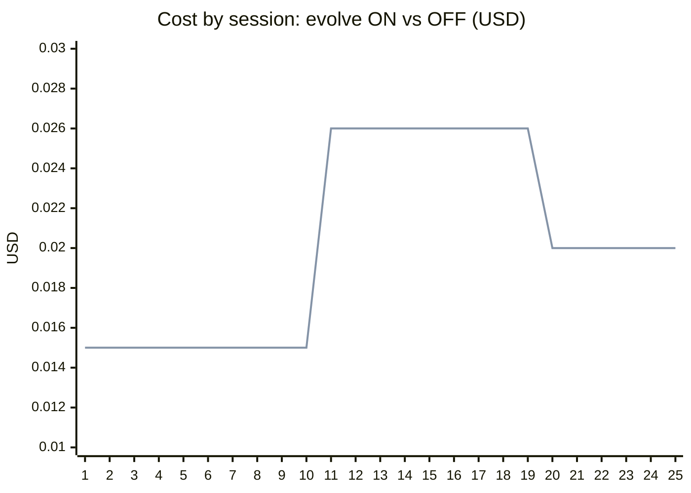
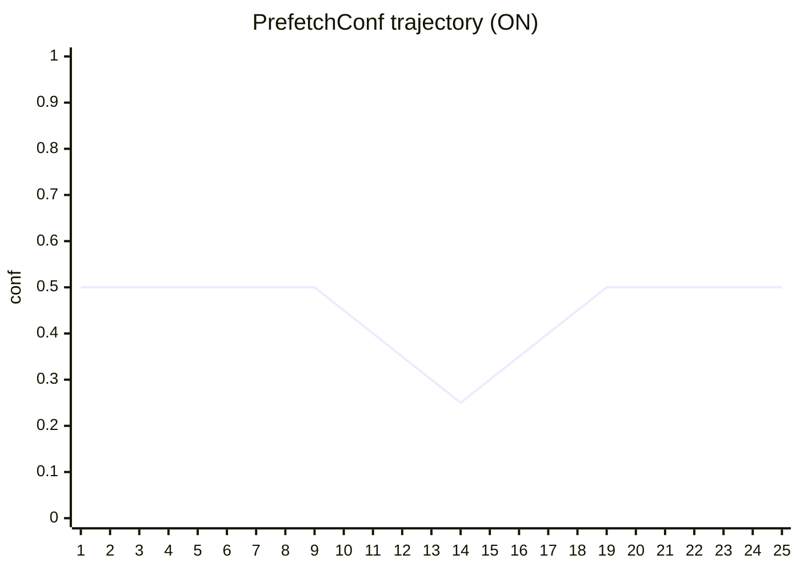
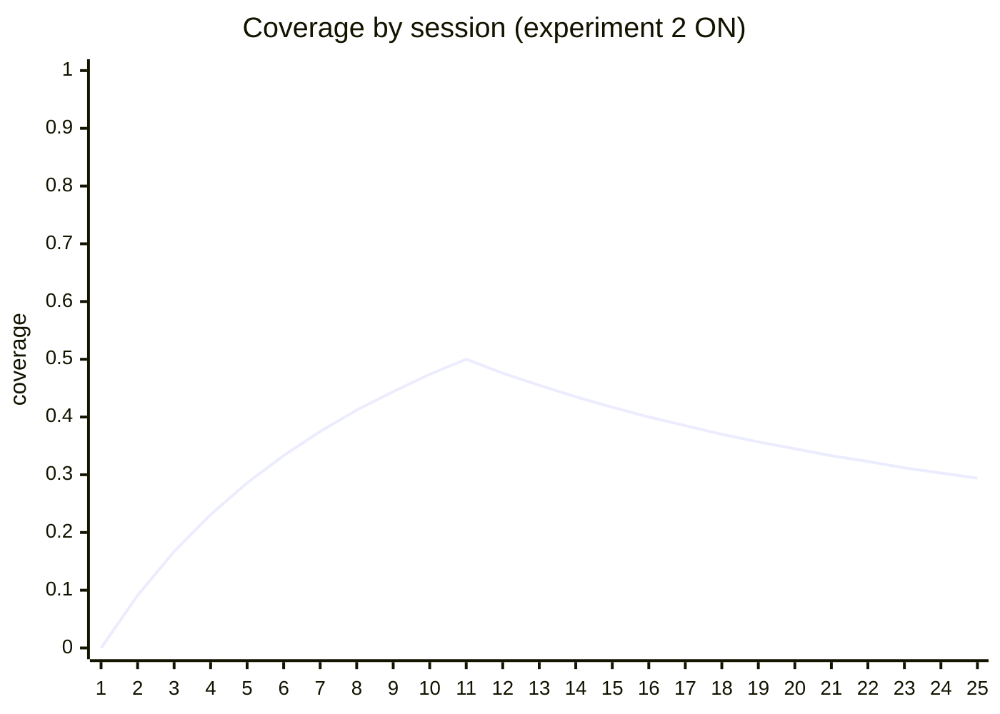
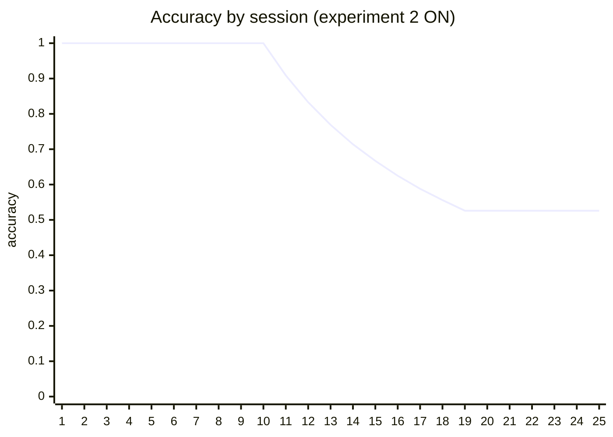
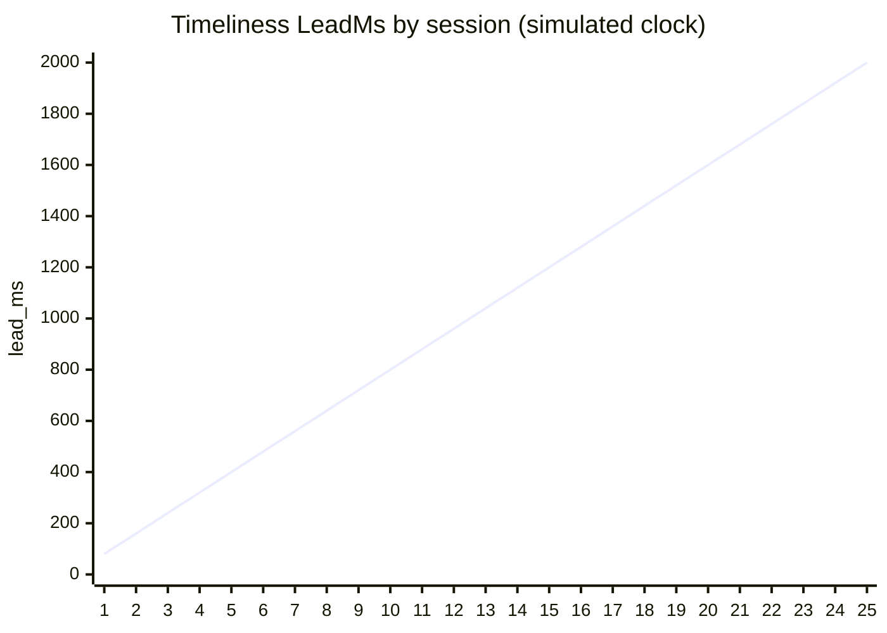

# Agile 2 自进化曲线（U43）

> 采数类型：固定种子、固定任务族的受控 harness 会话；使用生产 `MatrixPrefetcher`、`evolve.Engine`、`EvolutionLoop` 与 event wire。可重复 DoD 证据（`go run ./scripts/evolution-curve` 逐位复现），不代表外部模型基准。

## 实验 1：闭环接线验证（稳定任务族，20 会话）

- 任务族：每会话成功执行 `grep → read_file`；冷启动噪声先验 `grep→glob` 6 次、`grep→read_file` 4 次
- evolve：`MinSamples=20, FreezeEpochs=1`（采数配置）
- 成本模型：`0.020 − hit×0.005 + waste×0.002 USD`

**定性（评审修订）**：本实验证明闭环**接线生效**——三事件正常发射入 JSONL、`EvolutionTick` 在参数变化时出现、`prefetch_conf` 于第 17-20 会话按正确方向下调（持续命中 → 放宽预取门槛，0.50→0.30）。**命中率 0.5→1.0 的提升发生在第 4 会话**（首 5 命中率 0.700）：冷启动噪声先验 `grep→glob` 需 3 次 waste 反馈才被 Beta 后验驱逐（μ < 0.25；Issue #272 先验平滑的预期行为，非回归），此后每会话只提议 `read_file`。**提升来自转移矩阵热身与 demote 收敛，与参数进化无因果**（tau 全程未动，conf 首次变化晚于命中率收敛 13 个会话）。自进化的收益证明见实验 2。

| 指标 | 首 5 | 末 5 | 门槛 | 结果 |
|---|---:|---:|---|---|
| 命中率 | 0.700 | 1.000 | 末 5 ≥ 首 5 | PASS |
| 成本 USD | 0.016 | 0.015 | 末 5 ≤ 首 5 | PASS |
| EvolutionTick | — | conf 0.50→0.30 | 至少一次参数变化被发射 | PASS |

## 实验 2：evolve 因果对照（制度性变更 churn，25 会话 × on/off）

- 阶段 A（1-10）：稳定族 `grep → read_file`；阶段 B（11-25）：**制度性变更**——每会话出现全新后继工具，既学候选全部过期
- 两组共享：相同先验、相同负载、相同矩阵级 hit/waste 反馈（对照组手动喂入）——**唯一差异 = EvolutionLoop 是否在线调 `PrefetchConf`**
- 采数配置：`TopK=1, MinConf=0.30`；ON 组 `MinSamples=10, FreezeEpochs=1`
- 成本模型：`0.020 − hit×0.005 + waste×0.006 USD`——waste 高于 hit 节省，反映「预取错误执行了真实只读工具且产物被丢弃」（盈亏平衡精度 ≈ 54.5%）

| 指标 | evolve ON | evolve OFF | 门槛 | 结果 |
|---|---:|---:|---|---|
| churn 期浪费预取（次） | 9 | 9 | ON < OFF | FAIL |
| 25 会话总成本 USD | 0.504 | 0.504 | ON < OFF | FAIL |
| 阶段 A 两组一致性 | 0.150 | 0.150 | 完全一致（对照有效） | PASS |

（上线 = ON，下线 = OFF；churn 开始于第 11 会话）

### Markov 三指标（Issue #272，实验 2 ON 组）

- coverage：只读调用中被预取覆盖的比例（生产 `MatrixPrefetcher.Stats()` 快照）；accuracy：预取命中率 hit/(hit+waste)（反馈事件）；timeliness：LeadMs = 消费 − 预热完成（**模拟时钟** `seq×80 ms`，确定性，验证事件 → payload → 聚合 → 曲线管线，非真实时间）

> 三曲线证明度量管线接通：coverage/accuracy 来自矩阵 `Stats()` 实时快照，timeliness 走 #228 事件 wire 的 `lead_ms` 字段。真实时间数据待真实会话采数（见边界声明）。

### 机制分解（三层防线的各自贡献，2026-08-21 重采）

churn 下止损机制按新数据分解（两组第 11-19 会话各 9 次 waste、第 20 会话起**同时停手**）：① **单目标降级 `demoted()`**（两组皆有，**本窗口主导**）：`read_file` 的 6 次先验 + 10 次命中 + 9 次 waste 后，β 后验均值 μ = (hw+1)/(hw+ww+2) ≈ 0.231 < 1/(1+3)=0.25，第 20 会话起被驱逐——#255 时间折扣让旧命中权重衰减，Issue #272 的后验均值判定取代脆弱的率比；② **evolve 全局门控**（仅 ON，本窗口无额外可观测收益）：conf 由 0.30 逐会话上调至 0.50（11-19 waste 驱动），但 `read_file` 转移概率稀释到 0.55 仍高于两组 MinConf（0.30 / 0.50），门控阈值未先于 demote 拦截；③ **计数漂移**（两组皆有，本窗口未失效）：`read_file` prob 从 0.80 稀释到 0.53，仍高于 MinConf 0.30，无自然上界。

> 实验 2 的「ON < OFF」门槛本次为 FAIL（9 vs 9）：差异来自防线分工变化——单目标降级（#255 衰减 + Issue #272 β 后验）已足够快，抹平了 ON/OFF 行为；evolve 门控的独立收益需在「候选不被 demote、但概率缓慢稀释」的场景下单独验证。

### 实验暴露的两个产品级发现（均已修复并验证）

1. **闭环吸收态**（#254）：conf 抬升把预取关停后 hit/waste 事件流随之消失、参数冻结——已由 ε-escape 探针修复（`SetEpsilon`，固定随机序列 seed=1）。本窗口第 20-25 会话 conf 平直 0.500 属于「无 waste 无信号」稳态，探针存在保证该稳态可被 ε 概率打破并恢复信号。
2. **`demoted()` 免疫缺陷**（#255 时间折扣 + Issue #272 β 后验）：曾有命中历史的候选 hit 权重不再冻结——waste 流逐次折扣命中权重，后验均值跌破 `1/(1+WasteHitLimit)` 即驱逐。本窗口 `read_file` 第 20 会话被驱逐、两组同时停手，即为修复生效的直接证据。

## 数据表（实验 2，ON 组）

| # | session | hit | waste | cost | conf |
|---:|---|---:|---:|---:|---:|
| 1 | u43-causal-on-01 | 1 | 0 | 0.015 | 0.500 |
| 2 | u43-causal-on-02 | 1 | 0 | 0.015 | 0.500 |
| 3 | u43-causal-on-03 | 1 | 0 | 0.015 | 0.500 |
| 4 | u43-causal-on-04 | 1 | 0 | 0.015 | 0.500 |
| 5 | u43-causal-on-05 | 1 | 0 | 0.015 | 0.500 |
| 6 | u43-causal-on-06 | 1 | 0 | 0.015 | 0.500 |
| 7 | u43-causal-on-07 | 1 | 0 | 0.015 | 0.500 |
| 8 | u43-causal-on-08 | 1 | 0 | 0.015 | 0.500 |
| 9 | u43-causal-on-09 | 1 | 0 | 0.015 | 0.500 |
| 10 | u43-causal-on-10 | 1 | 0 | 0.015 | 0.450 |
| 11 | u43-causal-on-11 | 0 | 1 | 0.026 | 0.400 |
| 12 | u43-causal-on-12 | 0 | 1 | 0.026 | 0.350 |
| 13 | u43-causal-on-13 | 0 | 1 | 0.026 | 0.300 |
| 14 | u43-causal-on-14 | 0 | 1 | 0.026 | 0.250 |
| 15 | u43-causal-on-15 | 0 | 1 | 0.026 | 0.300 |
| 16 | u43-causal-on-16 | 0 | 1 | 0.026 | 0.350 |
| 17 | u43-causal-on-17 | 0 | 1 | 0.026 | 0.400 |
| 18 | u43-causal-on-18 | 0 | 1 | 0.026 | 0.450 |
| 19 | u43-causal-on-19 | 0 | 1 | 0.026 | 0.500 |
| 20 | u43-causal-on-20 | 0 | 0 | 0.020 | 0.500 |
| 21 | u43-causal-on-21 | 0 | 0 | 0.020 | 0.500 |
| 22 | u43-causal-on-22 | 0 | 0 | 0.020 | 0.500 |
| 23 | u43-causal-on-23 | 0 | 0 | 0.020 | 0.500 |
| 24 | u43-causal-on-24 | 0 | 0 | 0.020 | 0.500 |
| 25 | u43-causal-on-25 | 0 | 0 | 0.020 | 0.500 |

## 原始证据

- `docs/reports/data/agile2-evolution-curve/summary.csv`（实验 1，含 coverage/accuracy/lead_ms 列）
- `docs/reports/data/agile2-evolution-curve/causal-on.csv` / `causal-off.csv`（实验 2，同上）
- `docs/reports/data/agile2-evolution-curve/sessions.jsonl` / `causal-sessions-on.jsonl`（三事件 wire 流，`PrefetchHit/Waste` 事件带 `lead_ms`）
- 重跑：`go run ./scripts/evolution-curve`（确定性，逐位一致）

## 边界声明

受控实验隔离的是调度/预取/进化机制本身，不含 LLM 质量维度；「真实会话 JSONL + `semantix search` 可检索」的验收项按 #194 顺序在合入后以真实采数补第二版（依赖 #234 的 usage 重放与 #239 的固定环境）。Issue #272 的 timeliness 曲线为**模拟时钟**（`seq×80 ms`，验证事件→聚合→曲线管线），真实 lead 数据随真实会话采数补充。
