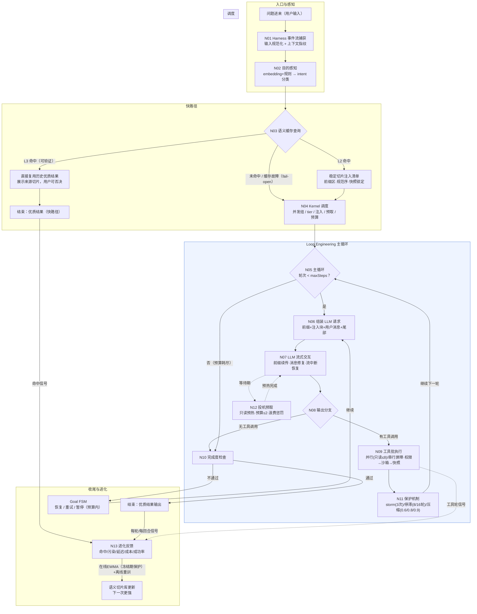

# 总体架构 · 端到端流程树（供生成树状流程图）

> 本文件是**喂给其他 agent 生成树状流程图的结构化输入**：描述"一个问题进来，
> 经过怎样的流程、loop engineering 与 LLM 交互，最终获得优质结果"。
> 每个节点给出编号、职责、输入/输出与关键参数，可直接转换为
> mermaid / markdown 树 / 思维导图。机制出自《Agent-Infra-架构设计.md》（v2 修复版）
> 及其基线的 Semantix harness 代码（[DeepSeek-Reasonix](https://github.com/esengine/DeepSeek-Reasonix)，
> MIT，`main-v2` 分支；storm/停滞/压缩阈值等 loop 保护机制源于 agent.go/compact.go）。

---

## 0. 用途与阅读指引

- **总览**：见 §1 主流程树（13 个主节点）。
- **细节**：每个节点在 §2 有"职责 / 输入 / 输出 / 关键参数"四要素。
- **LLM 交互**：§3 是循环体内每次与 LLM 交互的"三明治结构"（前后缀组成）。
- **成品**：§4 提供可直接使用的 mermaid 源码（flowchart + 子图）。
- **图例**：`[决策]` = 分支判断；`[循环]` = 回边；`[并行]` = 可并发；`[LLM]` = 与大模型交互。

---

## 1. 主流程树（问题 → 优质结果）

```
问题进来（用户输入）
│
├─ N01 [入口] Harness 事件流捕获
│    └─ 输入规范化（原文 + 上下文指纹）
│
├─ N02 目的感知（Intent Perception）
│    └─ embedding + 规则 → intent 分类
│       （修bug/加功能/重构/测试/问答/研究…）
│
├─ N03 [决策] 语义缓存查询（三层，快路径优先）
│    ├─ L3 命中（意图+输入指纹相似且可验证）
│    │    └─ 直接复用结果 →【结束：优质结果（快路径）】
│    ├─ L2 命中 → 稳定切片注入清单（前缀区，规范序+快照锁定）
│    └─ 未命中 / 缓存层故障 → fail-open 直接放行（绝不阻塞主循环）→ N04
│
├─ N04 Kernel 调度（联合决策）
│    ├─ 并发组划分（静态 ReadOnly + 行为候选）
│    ├─ 模型 tier（flash/pro）
│    ├─ L2 注入清单（预算内整切片取舍）
│    ├─ 预取清单（只读）
│    └─ 预算门控
│
├─ N05 [循环] Loop Engineering 主循环（核心，见 §3）
│    │   for 轮次 < maxSteps
│    ├─ N06 组装 LLM 请求（三明治结构）
│    │    系统前缀(不变) + L2 注入块(稳定) + 用户消息 + 尾部(可变)
│    ├─ N07 [LLM] 流式交互（DeepSeek API）
│    │    ├─ 前缀续传（length 截断续写，合并记账）
│    │    ├─ 消息修复（NormalizeMessages：配对/回填/闭合截断 JSON）
│    │    └─ 输出：文本 或 工具调用(tool_calls)
│    ├─ N08 [决策] 输出分支
│    │    ├─ 无工具调用 → N10 完成度检查
│    │    └─ 有工具调用 → N09 工具批执行
│    │         ├─ [并行] 只读工具并发（≤8）/ 写工具串行屏障
│    │         ├─ 权限门控 → 沙箱强制 → 快照安全网
│    │         └─ 结果回填会话（与 tool_calls 配对）→ 回到 N05 下一轮
│    ├─ N11 保护机制（loop engineering 关键，每轮检查）
│    │    ├─ storm 防死循环（同工具连续失败3次→改方向指令）
│    │    ├─ todo 停滞检测（8轮提示 / 16轮暂停）
│    │    ├─ 上下文压缩（0.6 截短 / 0.8 归档 / 0.9 摘要）
│    │    └─ 轮次预算 + 宽限轮（grace round）
│    └─ N12 [并行] 投机预取（LLM 等待期）
│         只读资源预热（下一轮切片组装/embedding）
│
├─ N10 [决策] 完成度检查（Final Readiness）
│    ├─ 通过 →【结束：优质结果输出】
│    └─ 不通过 → Goal FSM（恢复/重试/暂停，预算内继续）
│
└─ N13 进化反馈（自进化闭环，每轮/每回合）
     ├─ 信号：命中/污染/延迟/成本/成功率
     ├─ 在线 EWMA 调参（冻结期保护注入集）
     └─ 离线重训（切片嵌入/转移矩阵/阈值搜索）
          └─ 回写语义切片库 → 下一次"我"更强
```

---

## 2. 节点明细（每个节点的四要素）

### N01 入口 — Harness 事件流捕获
- **职责**：从 harness（Semantix 等）事件流截获用户输入与上下文。
- **输入**：用户消息 + 会话状态（TurnStarted 事件）。
- **输出**：规范化输入（原文 + 上下文指纹）。
- **关键参数**：事件规范化统一为 kernel 内部模型（Semantix event 为第一方言）。

### N02 目的感知
- **职责**：判断"这个问题的应用目的"，驱动后续所有调度决策。
- **输入**：规范化输入 + embedding。
- **输出**：intent 分类（修bug/加功能/重构/测试/问答/研究）。
- **关键参数**：用 embedding+规则，**不调 LLM**（每轮分类的 LLM 成本会吃掉缓存收益）。

### N03 语义缓存（三层快路径）
- **职责**：先查"是否做过类似的事"，避免重复劳动。
- **L3 结果复用**：意图指纹 + 输入指纹相似 ≥ τ'，且通过 mtime/SHA 文件指纹验证、
  只读任务白名单、24h 过期 → **直接返回历史优质结果**（不发模型请求，但展示来源切片，用户否决即失效）。
- **L2 稳定注入**：命中 P/C/M 切片 → 原样注入（字节稳定），供本轮 LLM 使用并喂养 L1。
- **fail-open**：未命中直接放行；嵌入模型挂掉 / ANN 检索超时 → 跳过语义层
  （退化为基础 harness），缓存层失败**绝不阻塞主循环**（架构设计 §10-8）。
- **关键参数**：τ / τ' 由进化引擎调节；检索必须确定性（同输入→同 top-k）。

### N04 Kernel 调度（联合决策）
- **职责**：一次工具轮的资源编排总纲。
- **决策项**：并发组（静态 ReadOnly 基线 + 行为学习候选，候选须过数据依赖检查）、
  模型 tier（简单→flash，复杂/低成功率→pro）、注入清单（预算内按价值整切片取舍、
  顺序固定规范序 ID 升序）、预取清单、总预算裁剪。
- **优先级**：正确性 > 缓存命中 > 并发度 > 预取。

### N05 主循环（Loop Engineering 核心）
- **职责**：迭代式"思考→行动→观察"循环，直到获得优质结果。
- **循环条件**：轮次 < maxSteps（或宽限轮）。
- **每轮四步**：组装请求（N06）→ LLM 交互（N07）→ 分支（N08）→ 保护检查（N11）。

### N06 LLM 请求组装（三明治结构，详见 §3）
- **职责**：构造发给模型的完整 prompt，**前缀字节稳定**是缓存命中的命根子。
- **组成（自上而下）**：系统前缀（system+tools+记忆索引，**永不改**）→
  L2 注入块（稳定切片，规范序，快照锁定）→ 用户消息 → 尾部（会话内可变内容：
  记忆更新/后台任务/hook 上下文）。

### N07 LLM 流式交互
- **职责**：与 DeepSeek 的每次对话（流式，SSE）。
- **内部机制**：
  - **前缀续传**：finish_reason=length 且无工具调用时，经 Beta 端点续写，两个请求合并记账（省钱）；
  - **消息修复**：发送前 NormalizeMessages——回填未应答 tool_calls、丢弃孤儿消息、
    闭合截断的 JSON 参数（健康会话零分配直通，保缓存键稳定）；
  - **流中断恢复**：零输出才重放（≤3 次），已输出则报中断错误。
- **输出**：文本增量 / 完整 tool_calls / usage（含缓存命中统计）。

### N08 输出分支
- **无工具调用** → 进入完成度检查（N10），模型认为任务已完成。
- **有工具调用** → 工具批执行（N09），把结果喂回下一轮。

### N09 工具批执行
- **职责**：执行模型请求的工具调用（模型的"手脚"）。
- **调度**：只读工具并行（信号量 ≤8，等价 allSettled）；写工具串行屏障（保序）；
  行为学习组仅作候选，须过静态数据依赖检查。
- **安全链**：权限门控（deny>sessionAllow>ask>allow>fallback）→
  OS 沙箱（Seatbelt/bubblewrap，fail-closed）→ 快照安全网（写前快照，可回滚）。
- **结果回填**：工具结果与 tool_calls 配对写入会话 → 回到 N05 下一轮。

### N10 完成度检查
- **职责**：判断"当前结果是否达到优质标准"，而不是模型说了算。
- **检查项**：todo 是否完成、delivery 门（action/mutation/verification/review）、
  无 writer 时缺项即不通过（除非 loop-guard 放行）。
- **不通过时**：Goal FSM 接管——预算内继续（缺什么补什么）、暂停
  （no-progress 4 轮，见模块算法详解 C.2 goal.go:30）、或恢复/重试。

### N11 保护机制（防劣质结果的四道闸）
- **storm**：同工具连续 3 次同因失败 → 不再回显错误，改写为"换思路"指令；
- **todo 停滞**：8 轮无进展提示重估，16 轮暂停（防空转烧钱）；
- **上下文压缩**：0.6 截短旧工具输出 / 0.8 归档 / 0.9 摘要（推迟缓存重置点）；
- **轮次预算**：maxSteps + 宽限轮（最后一轮只许总结，不许再调工具）。

### N12 投机预取
- **职责**：填满 LLM 等待期（数秒~数十秒），提升端到端延迟。
- **对象**：只读资源——下一轮 LLM 请求的切片组装、embedding 查询（参数可预知、收益可量化）；
  文件预热与 grep 结果依赖未定参数，低优先级。
- **约束**：预取并发 ≤2、单次 ≤2k token、waste/hit > 3:1 自动降权（预取也自进化）。

### N13 进化反馈（自进化闭环）
- **职责**：让系统"越用越好"——从每次交互学习。
- **信号**：L1/L2/L3 命中、注入污染（用户编辑注入块）、预取 hit/waste、
  延迟、成本、任务成功率、用户显式反馈。
- **更新**：在线 EWMA 调参（τ/τ'/预算/预取阈值），**冻结期（≥1h）内注入集不变**
  （防参数抖动摧毁自己喂养的缓存）；离线重训（嵌入刷新/转移矩阵/阈值搜索）。
- **回写**：语义切片库（新切片入库、权重更新）→ 下一次会话更强。

---

## 3. LLM 交互三明治结构（每次请求的 prompt 组成）

```
┌─────────────────────────────────────────────┐
│ ① 系统前缀（字节不变，L1 缓存命中区）        │
│    system 提示 + 工具 schema + 记忆索引       │  ← 永不改
├─────────────────────────────────────────────┤
│ ② L2 注入块（跨会话稳定，缓存扩展区）         │
│    命中切片原样注入，规范序 ID 升序           │  ← 快照锁定（参数/库变更延迟生效）
│    <slice id=...> 包裹，注入前净化            │
├─────────────────────────────────────────────┤
│ ③ 用户消息（本次问题）                       │  ← 每轮唯一真正变化的主体
├─────────────────────────────────────────────┤
│ ④ 尾部（会话内可变内容）                     │
│    记忆更新 / 后台任务完成 / hook 上下文      │  ← 只挂尾部，不进前缀
└─────────────────────────────────────────────┘
        │
        ▼
   DeepSeek API（流式）
        │
        ├─ 前缀续传（length 截断续写，合并记账）
        ├─ 输出：文本 or tool_calls
        └─ 回填：结果配对 → 下一轮（①不变，②不变，③④更新）
```

**关键点**：①和②跨轮字节不变 → 每轮请求的前缀稳定 → L1 缓存持续命中；
③④变化只发生在尾部与用户消息，不破坏前缀。

---

## 4. mermaid 源码（可直接使用）



---

## 5. 生成流程图时的要点提示（给接收 agent）

1. **主骨架**：入口 → 感知 → 快路径 → 调度 → **主循环（核心）** → 完成度 → 进化；
2. **主循环是重点**：画出"组装请求 → LLM → 分支（工具/最终）→ 保护检查 → 回边"，
   以及预取器与 LLM 等待期的并行关系（虚线）；
3. **三明治结构**单独成图或作为主循环的子图：①不变前缀 ②稳定注入块 ③用户消息 ④可变尾部；
4. **决策菱形**：N03（三层缓存）、N08（输出分支）、N10（完成度）、N05（轮次预算）；
5. **回边标注**：主循环回边、Goal FSM 重试回边、进化反馈回边（虚线，长周期）；
6. **并行标注**：N09 工具并行（≤8）、N12 预取与 LLM 流式并行（等待期）。
